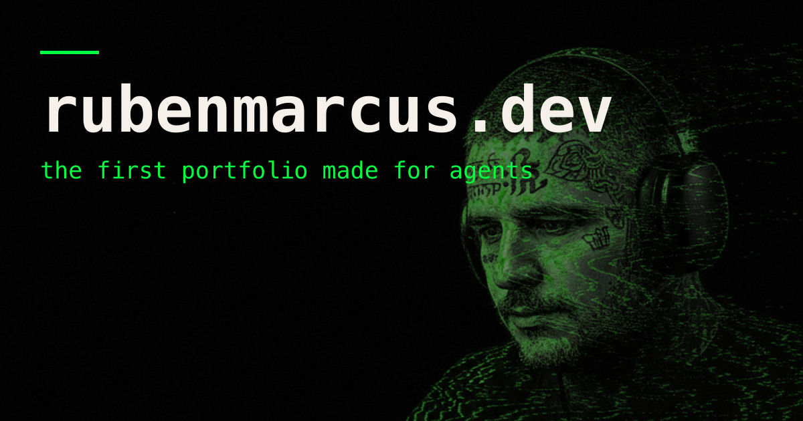

# rubenmarcus.dev



Personal portfolio. **Agent-ready · humans welcome.** Terminal-green and agent-first: a cinematic 3D hero, a blog
written for humans and machines, and an MCP server so AI agents can read the
resume and book a call without ever rendering the page.

**Live:** [rubenmarcus.dev](https://rubenmarcus.dev)

## Stack

- [Astro 5](https://astro.build) (islands, content collections, i18n EN/PT)
- [Svelte 5](https://svelte.dev) (runes) for interactive components
- [Three.js](https://threejs.org) — custom GLSL shaders (ice-flow background,
  contour/wireframe/ASCII render states)
- [GSAP](https://gsap.com) + [Lenis](https://lenis.darkroom.engineering) — scroll choreography
- [Tailwind CSS 3](https://tailwindcss.com)
- Vercel (adapter with edge middleware, Analytics)

## Features

- Hero with an AI-generated, auto-rigged 3D character that types at a desk and
  dissolves through render states (contour isolines → wireframe → scanline
  point cloud → ASCII) driven by scroll
- Live HUD telemetry fed by GitHub/npм stats, degrading gracefully offline
- Bilingual blog (EN + PT mirrors) with generated particle-art covers,
  copy-button code blocks, view counter (optional Supabase)
- `/api/mcp` — a hand-rolled JSON-RPC 2.0 MCP server (`tools/list`,
  `tools/call`) exposing resume data and a `book_intro` tool
- `/api/hire` — contact endpoint with field caps + honeypot, relayed via
  formsubmit.co
- `llms.txt`, `robots.txt` with AI-crawler rules, RSS (EN/PT), sitemap with
  hreflang, JSON-LD — built for answer engines, not just search
- Edge middleware easter egg: `curl rubenmarcus.dev` returns a plain-text resume
- Bottom-right audio deck (YouTube IFrame API) persisted across page
  transitions
- Visual QA gauntlet (`scripts/visual-gauntlet.mjs`) that screenshots every
  page on desktop + mobile and captures console errors

## Getting started

```bash
pnpm install
pnpm dev
```

Production build:

```bash
pnpm build
pnpm preview
```

Quality gates:

```bash
pnpm check       # astro check (types)
pnpm text:gate   # prose lint for the blog voice (scripts/text-gate.mjs)
```

## Environment variables

Everything degrades gracefully without env vars. Optional:

- `PUBLIC_SUPABASE_URL` + `PUBLIC_SUPABASE_ANON_KEY` — blog view counter
- `OPENROUTER_API_KEY` — only for the asset-generation scripts in `scripts/`

## Project structure

```
src/
  components/        # Svelte/Astro components (hero, deck, cards, lab demos)
  content/           # blog (EN) + blog-pt collections, zod-validated
  layouts/           # BaseLayout: SEO, OG, JSON-LD, analytics, audio deck
  lib/               # data (projects, agents, tools), three/, motion/, assets/
  pages/
    api/             # hire.ts, mcp.ts, resume.json.ts, resume.txt.ts
    pt/              # PT mirrors of every page
    work/            # case studies
  middleware.ts      # edge: curl user-agent → text resume
scripts/             # asset generators (OpenRouter) + text-gate + visual gauntlet
public/art/          # generated covers, logos, frames
qa/                  # gauntlet shots + scoring log
```

## License

MIT
